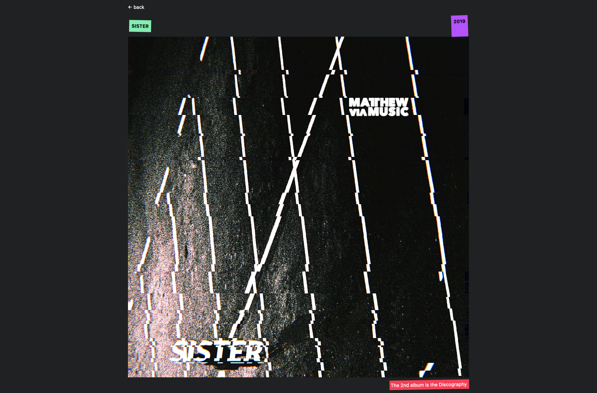

[VISIT LIVE SITE](https://matthewviamusicplayer.github.io/)

[API](https://mvmapi.olk1.com/albums)




```
npm create astro@latest projectName
npx astro add tailwind

"dev": "astro dev --port 5000",

npm run build
```